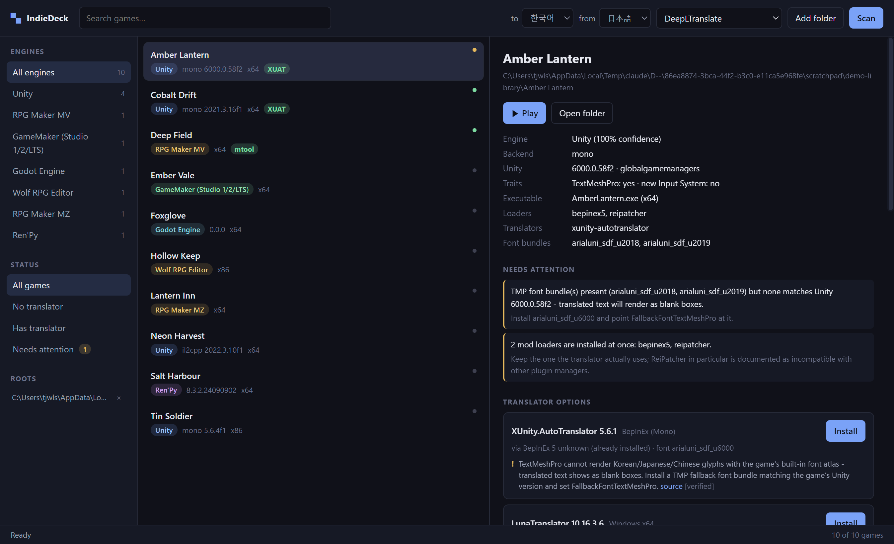

# IndieDeck

One launcher for a messy indie game folder: it classifies the engine, works out
**which translator build actually fits that specific game**, installs it with the
right mod loader, and manages mods per engine.



The hard part is not downloading XUnity.AutoTranslator. It is knowing that *this*
game is IL2CPP so the Mono package will never load, that the BepInEx 6 build has
to be a bleeding-edge one, that the ReiPatcher package disappeared from release
v5.6, that DeepL stopped working below 5.5.2, and that the TextMeshPro font atlas
you copied in was built for Unity 2018 while the game is Unity 2022 — which is
why the translated text renders as blank boxes. IndieDeck encodes those rules,
with sources, and applies them per game.

```
$ indiedeck scan D:\
Scanned 1 root(s) in 6.5s - 110 games found

By engine
  ID             ENGINE                      GAMES
  unity          Unity                          43
  rpgmaker-mz    RPG Maker MZ                   19
  renpy          Ren'Py                         19
  rpgmaker-mv    RPG Maker MV                   13
  godot          Godot Engine                    7
  unreal         Unreal Engine                   3
  ...
  translator installed: 45  mod loader installed: 14  unity mono/il2cpp: 26/17
```

## What it does

**Engine classification.** 17 engines via a declarative, scored signature
registry — Unity (with Mono/IL2CPP backend, exact engine version, TextMeshPro and
new-Input-System detection), Ren'Py, RPG Maker MV/MZ/XP/VX/VX Ace, Wolf RPG,
Godot, GameMaker, Unreal, KiriKiri, NScripter, TyranoScript, LÖVE, NW.js,
Electron, Java, Flash. Architecture comes from the PE header, not from a folder
name.

**Translator install with real version management.** `plan` ranks every viable
(translator, variant, version, loader) combination and shows *why* each one is
blocked or preferred, each finding carrying a confidence level and a source URL.
`install` then downloads, extracts, writes the config, and records a receipt so
`uninstall` can put the folder back.

**Mod management.** One model over BepInEx `plugins/`, MelonLoader `Mods/`,
GDWeave, UE4SS, RPG Maker `js/plugins` (including the `plugins.js` registry) and
Ren'Py `game/` — list, add, enable, disable, with the right disable strategy for
each host.

**A doctor for setups that silently do not work.** `check` sweeps the library for
TMP font bundles that do not match the game's Unity line, two mod loaders
installed at once, translator plugin files with no loader to load them, and
translator versions that predate a fix the chosen endpoint needs.

## Install

Requires Node 22.6+ (24+ recommended). No native dependencies.

```bash
git clone https://github.com/tjwlstj/indie-deck.git
cd indie-deck
npm install
npm run build
npm link --workspace packages/cli   # optional: puts `indiedeck` on PATH
```

Without `npm link`, run it as `node packages/cli/dist/index.js <command>`.

For the desktop launcher:

```bash
npm run desktop
```

The window is a thin shell over the same core the CLI uses - it renders the
library, the compatibility findings for the selected game, and installs with one
click. It runs with context isolation on and no node integration in the
renderer; the only bridge is a fixed list of IPC channels in
[`preload.cjs`](packages/desktop/preload.cjs).

## Use

```bash
indiedeck root add "D:\"            # register a library root
indiedeck scan                      # classify everything under it
indiedeck list --engine unity --untranslated
indiedeck info "Amber Lantern"      # engine, backend, versions, what's installed

indiedeck plan "MyGame" --lang ko --from ja --endpoint DeepLTranslate
indiedeck install "MyGame" --lang ko --from ja
indiedeck uninstall "MyGame"        # removes exactly what it installed

indiedeck mods list "MyGame"
indiedeck mods add "MyGame" ./cool-mod.zip
indiedeck mods disable "MyGame" cool-mod

indiedeck check                     # library-wide health sweep
indiedeck registry check --online   # is the pinned data still current?
```

Every command takes `--json` for scripting, and nothing is written to a game
folder without a receipt. `install --dry-run` prints the exact plan first.

## How the compatibility engine works

A scan produces a **game profile** (engine, backend, engine version, arch,
already-installed loaders/translators/font bundles). The resolver expands that
into candidate plans and runs the rules in [`registry/compat.json`](registry/compat.json)
over each one:

| severity | effect |
| --- | --- |
| `block` | candidate is removed — e.g. a Mono package on an IL2CPP game |
| `warn`  | kept, but scored down and surfaced to the user |
| `info`  | annotation only |
| `prefer`| score adjustment — reuse an installed loader, avoid bleeding-edge |

Rules carry `confidence` (`verified` / `inferred` / `community` / `unverified`)
and `sources`. An `unverified` rule — a widely repeated claim that upstream docs
do not actually state — can only ever warn, never block. An unknown engine
version never triggers a version gate; it downgrades to an advisory instead.

Some of the rules currently encoded:

- IL2CPP games need the `BepInEx-IL2CPP` or `MelonMod-IL2CPP` package; BepInEx 5
  cannot host them at all ([BepInEx docs](https://docs.bepinex.dev/articles/user_guide/installation/index.html)).
- XUnity.AutoTranslator's IL2CPP packages dropped pre-2017 Unity in 5.3.0, and
  5.4.0+ is built against BepInEx bleeding-edge build 704 or newer ([CHANGELOG](https://github.com/bbepis/XUnity.AutoTranslator/blob/master/CHANGELOG.md)).
- Release v5.6 ships no ReiPatcher asset, so that variant pins 5.6.1 or 5.5.2.
- DeepL below 5.5.2 sends legacy auth the current API rejects.
- New-Input-System games need 5.5.1+ or the in-game hotkeys do nothing.
- ReiPatcher is incompatible with any other plugin manager already installed.
- Korean/Japanese/Chinese on a TextMeshPro game needs a fallback font atlas built
  for that Unity line — see [`registry/fonts.json`](registry/fonts.json).

## The registry

Everything the resolver knows lives in plain JSON, separate from the code:

| file | contents |
| --- | --- |
| [`engines.json`](registry/engines.json) | scored detection signatures per engine |
| [`loaders.json`](registry/loaders.json) | mod loaders, their constraints, download assets, mod layouts |
| [`translators.json`](registry/translators.json) | translators, their variants and version tables |
| [`compat.json`](registry/compat.json) | the compatibility rules |
| [`fonts.json`](registry/fonts.json) | TMP font atlases mapped to Unity version ranges |

`indiedeck registry check` validates every cross-reference; `--online` compares
the pinned versions against upstream GitHub releases so staleness is visible
rather than silent.

## Tools it knows about

Installable: XUnity.AutoTranslator (all 7 packaging variants), BepInEx 5 /
BepInEx 6 Mono / BepInEx 6 IL2CPP, MelonLoader, MORT, LunaTranslator, Textractor,
GDWeave, UE4SS, renpy-translator, projz_renpy_translation, RPGMakerTranslator.

Detect-only, because they are closed source or distributed outside GitHub: MTool,
Translator++, Unity Mod Manager. IndieDeck reports them so the library view stays
honest, and links out rather than pretending it can install them.

## Design notes

- **No native dependencies.** ZIP extraction is a ~150-line reader over
  `node:zlib`; `.7z` (the TMP font archive) borrows an extractor already on the
  machine — 7-Zip if present, otherwise the bsdtar that ships with Windows 10+.
- **Never execute a third-party binary silently.** The ReiPatcher setup rewrites
  game assemblies, so it needs an explicit `--allow-run` and takes a snapshot of
  `Managed/` first.
- **Receipts, not guesswork.** Every install records the exact file list and any
  file it displaced, so uninstall is precise and reversible.
- **Config edits preserve the file.** `AutoTranslatorConfig.ini` is documented
  inline by upstream; IndieDeck rewrites individual keys and leaves every comment,
  unknown key and line ending intact.
- **Extraction is path-safe.** Absolute paths and `..` traversal in archives are
  rejected before anything is written.

## Development

```bash
npm run build      # tsc --build across the workspace
npm test           # node:test, no test framework dependency
```

Sources are TypeScript with erasable-only syntax, so `node --experimental-strip-types`
runs them directly without a build step.

## Contributing

The most valuable contributions are registry entries: a compatibility rule you
had to learn the hard way, an engine signature that misfires, a translator that
should be listed. See [CONTRIBUTING.md](CONTRIBUTING.md) — a rule needs a source
and an honest confidence level, and that is most of the review.

## License

MIT. IndieDeck installs third-party software that carries its own licenses —
BepInEx (LGPL-2.1), XUnity.AutoTranslator (MIT), MelonLoader (Apache-2.0),
LunaTranslator and Textractor (GPL-3.0), MORT (MIT). It downloads them from their
official release channels and does not redistribute them.
