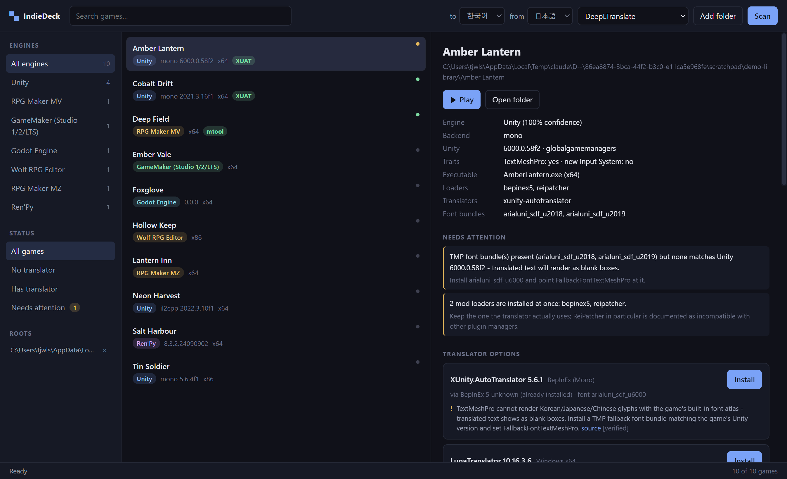
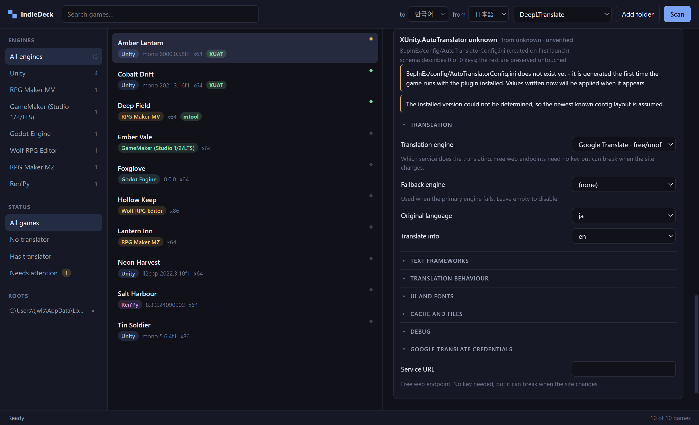

# IndieDeck

One launcher for a messy indie game folder: it classifies the engine, works out
**which translator build actually fits that specific game**, installs it with the
right mod loader, and manages mods per engine.



The hard part is not downloading XUnity.AutoTranslator. It is knowing that *this*
game is IL2CPP so the Mono package will never load, that the BepInEx 6 build has
to be a bleeding-edge one, that the ReiPatcher package disappeared from release
v5.6, that DeepL stopped working below 5.5.2, and that the TextMeshPro font atlas
you copied in was built for Unity 2018 while the game is Unity 2022 — which is
why the translated text renders as blank boxes. IndieDeck encodes those rules,
with sources, and applies them per game.

```
$ indiedeck scan D:\
Scanned 1 root(s) in 6.5s - 110 games found

By engine
  ID             ENGINE                      GAMES
  unity          Unity                          43
  rpgmaker-mz    RPG Maker MZ                   19
  renpy          Ren'Py                         19
  rpgmaker-mv    RPG Maker MV                   13
  godot          Godot Engine                    7
  unreal         Unreal Engine                   3
  ...
  translator installed: 45  mod loader installed: 14  unity mono/il2cpp: 26/17
```

## What it does

**Engine classification.** 17 engines via a declarative, scored signature
registry — Unity (with Mono/IL2CPP backend, exact engine version, TextMeshPro and
new-Input-System detection), Ren'Py, RPG Maker MV/MZ/XP/VX/VX Ace, Wolf RPG,
Godot, GameMaker, Unreal, KiriKiri, NScripter, TyranoScript, LÖVE, NW.js,
Electron, Java, Flash. Architecture comes from the PE header, not from a folder
name.

**Translator install with real version management.** `plan` ranks every viable
(translator, variant, version, loader) combination and shows *why* each one is
blocked or preferred, each finding carrying a confidence level and a source URL.
`install` then downloads, extracts, writes the config, and records a receipt so
`uninstall` can put the folder back.

**Translator settings without hand-editing INI.** The config a translator reads
is described by a *versioned schema*: a stable id like `xunity.targetLanguage`
maps to whichever `(section, key)` the installed build actually uses, so the
form is not pinned to one version's layout. Editing preserves every comment,
every key IndieDeck does not describe, and the file's line endings; credentials
are redacted everywhere but the file itself. See
[docs/config-manager.md](docs/config-manager.md).



**Korean and English throughout.** Not just the chrome: the compatibility
findings, the audit messages, the install steps and the config labels are all
translated, because those are the sentences that actually decide what a user
does. Every message carries its catalogue key, so switching language re-renders
what is on screen without re-running the resolver, and an untranslated key falls
back to English rather than to a blank. Adding a language is one file in
[`locales/`](locales).

**Mod management.** One model over BepInEx `plugins/`, MelonLoader `Mods/`,
GDWeave, UE4SS, RPG Maker `js/plugins` (including the `plugins.js` registry) and
Ren'Py `game/` — list, add, enable, disable, with the right disable strategy for
each host.

**A doctor for setups that silently do not work.** `check` sweeps the library for
TMP font bundles that do not match the game's Unity line, two mod loaders
installed at once, translator plugin files with no loader to load them, and
translator versions that predate a fix the chosen endpoint needs.

**Optional Unity TMP fonts.** For Korean, Japanese or Chinese targets, the
launcher shows a bundle recommendation based on detected TextMeshPro and Unity
version, with registered versus inferred compatibility clearly separated. A
translator plan can include or exclude the recommended font. An existing,
compatible XUnity installation can add just the font, or link an existing atlas,
without reinstalling the translator. Only `Behaviour.FallbackFontTextMeshPro`
is patched in that separate operation; other settings and comments are retained.
Recommendations are not proof of rendering in a particular game. Non-TMP and
unknown-version games do not get a forced TMP installation action.

**Local MTool handoff for RPG Maker.** The Windows launcher can connect an
existing MTool bundle for RPG Maker MV/MZ and XP/VX/VX Ace (RGSS). It checks
`D:\MTool` by default, or a bundle folder selected in Settings. The game detail
card can open MTool with the detected game executable as one argument, open
MTool alone, locate the executable, and rescan the game after an external change.
This is not an MTool installer or proof of automatic game selection or working
translation: choose the languages and start translation in MTool, using its
manual drag/drop route if necessary. IndieDeck does not copy, download, update
or modify MTool's settings, library or activation files. Disconnecting only
disables the connection; it deletes nothing. Back up the game before using
MTool, and do not overlap its work with IndieDeck installs or mod changes.
External changes are outside IndieDeck's receipts and cannot be undone by its
Uninstall action. Wolf RPG is not part of this launcher handoff.

## Install

### Windows app

On Windows 10 or 11 x64, download the current version from
[GitHub Releases](https://github.com/tjwlstj/indie-deck/releases/latest):

- **`IndieDeck-Setup-…-x64.exe`** — recommended. Installs per user, creates
  Start Menu and desktop shortcuts, and checks published GitHub Releases for
  app updates. IndieDeck blocks a normal close while an install or config edit
  is pending; a downloaded update is applied after a later clean exit.
- **`IndieDeck-Portable-…-x64.exe`** — a single-file launcher that does not
  install. Portable builds are updated manually by replacing the executable.

The first release is not code-signed, so Windows SmartScreen may show an
"unknown publisher" warning. Verify the download against `SHA256SUMS.txt` on
the same release before running it. The project does not currently provide
32-bit or ARM64 Windows builds.

### Source and CLI

Requires Node 22.12+ (24+ recommended). No native dependencies.

```bash
git clone https://github.com/tjwlstj/indie-deck.git
cd indie-deck
npm install
npm run build
npm link --workspace packages/cli   # optional: puts `indiedeck` on PATH
```

Without `npm link`, run it as `node packages/cli/dist/index.js <command>`.

For the desktop launcher:

```bash
npm run desktop
```

The window is a thin shell over the same core the CLI uses - it renders the
library, the compatibility findings for the selected game, and installs with one
click. It runs with context isolation on and no node integration in the
renderer; the only bridge is a fixed list of IPC channels in
[`preload.cjs`](packages/desktop/preload.cjs). Install/removal progress stays attached to its game while you
open settings or select another game. The launcher shows the current stage,
download bytes and a collapsible log, then refreshes that game's badges,
statistics, detail and redacted config together. Reloading the renderer recovers
the active operation from main.

Safe update/repair and duplicate cleanup remain planned. The desktop currently
shows a reason and blocks reinstalling an already managed translator when that
would overwrite its original install record.

The offline `npm run desktop:flow` check exercises installation, settings
navigation, renderer reload, optional and standalone fonts, config/receipt
refresh, small-window sticky actions and ordered removal in Korean and English
using disposable game folders and mocked downloads. The font fixture is a real
7z archive containing synthetic bytes, not a working Unity atlas.

Maintainers can find the versioning, tag, artifact, signing and updater procedure
in [docs/releasing.md](docs/releasing.md).

## Use

```bash
indiedeck root add "D:\"            # register a library root
indiedeck scan                      # classify everything under it
indiedeck list --engine unity --untranslated
indiedeck info "Amber Lantern"      # engine, backend, versions, what's installed

indiedeck plan "MyGame" --lang ko --from ja --endpoint DeepLTranslate
indiedeck install "MyGame" --lang ko --from ja
indiedeck uninstall "MyGame"        # removes exactly what it installed

indiedeck mods list "MyGame"
indiedeck mods add "MyGame" ./cool-mod.zip
indiedeck mods disable "MyGame" cool-mod

indiedeck config "MyGame"           # translator settings, by semantic id
indiedeck config "MyGame" --set xunity.targetLanguage=ko --dry-run
indiedeck config "MyGame" --providers   # engines, their tier and what they need

indiedeck check                     # library-wide health sweep
indiedeck --help --locale ko        # anything, in Korean
indiedeck registry check --online   # is the pinned data still current?
```

Every command takes `--json` for scripting, and nothing is written to a game
folder without a receipt. `install --dry-run` prints the exact plan first.

## How the compatibility engine works

A game's presence in the library comes from scanning registered folders, not a
hardcoded title list. Engine signatures, supported translators, provider
catalogues and compatibility weights are curated registry data. Recommendations
are deterministic profile-and-rule ranking, not an AI/LLM model or a learned
game-success database. Detection confidence is a heuristic signature score,
not the probability that a translator will work at runtime.

A scan produces a **game profile** (engine, backend, engine version, arch,
already-installed loaders/translators/font bundles). The resolver expands that
into candidate plans and runs the rules in [`registry/compat.json`](registry/compat.json)
over each one:

| severity | effect |
| --- | --- |
| `block` | candidate is removed — e.g. a Mono package on an IL2CPP game |
| `warn`  | kept, but scored down and surfaced to the user |
| `info`  | annotation only |
| `prefer`| score adjustment — reuse an installed loader, avoid bleeding-edge |

Rules carry `confidence` (`verified` / `inferred` / `community` / `unverified`)
and `sources`. An `unverified` rule — a widely repeated claim that upstream docs
do not actually state — can only ever warn, never block. An unknown engine
version never triggers a version gate; it downgrades to an advisory instead.

Some of the rules currently encoded:

- IL2CPP games need the `BepInEx-IL2CPP` or `MelonMod-IL2CPP` package; BepInEx 5
  cannot host them at all ([BepInEx docs](https://docs.bepinex.dev/articles/user_guide/installation/index.html)).
- XUnity.AutoTranslator's IL2CPP packages dropped pre-2017 Unity in 5.3.0, and
  5.4.0+ is built against BepInEx bleeding-edge build 704 or newer ([CHANGELOG](https://github.com/bbepis/XUnity.AutoTranslator/blob/master/CHANGELOG.md)).
- Release v5.6 ships no ReiPatcher asset, so that variant pins 5.6.1 or 5.5.2.
- DeepL below 5.5.2 sends legacy auth the current API rejects.
- New-Input-System games need 5.5.1+ or the in-game hotkeys do nothing.
- ReiPatcher is incompatible with any other plugin manager already installed.
- Korean/Japanese/Chinese on a TextMeshPro game needs a fallback font atlas built
  for that Unity line — see [`registry/fonts.json`](registry/fonts.json).

## The registry

Everything the resolver knows lives in plain JSON, separate from the code:

| file | contents |
| --- | --- |
| [`engines.json`](registry/engines.json) | scored detection signatures per engine |
| [`loaders.json`](registry/loaders.json) | mod loaders, their constraints, download assets, mod layouts |
| [`translators.json`](registry/translators.json) | translators, their variants and version tables |
| [`compat.json`](registry/compat.json) | the compatibility rules |
| [`fonts.json`](registry/fonts.json) | TMP font atlases mapped to Unity version ranges |

`indiedeck registry check` validates every cross-reference; `--online` compares
the pinned versions against upstream GitHub releases so staleness is visible
rather than silent.

## Tools it knows about

Installable: XUnity.AutoTranslator (all 7 packaging variants), BepInEx 5 /
BepInEx 6 Mono / BepInEx 6 IL2CPP, MelonLoader, MORT, LunaTranslator, Textractor,
GDWeave, UE4SS, renpy-translator, projz_renpy_translation, RPGMakerTranslator.

Not installable by IndieDeck, because they are closed source or distributed
outside its release-download path: MTool, Translator++, Unity Mod Manager.
IndieDeck detects their installed markers. MTool additionally has the explicit
desktop-only local handoff described above; it is not downloaded, copied or
managed as an installed component. Translator++ and Unity Mod Manager remain
detect-and-link-only.

## Design notes

- **No native dependencies.** ZIP extraction is a ~150-line reader over
  `node:zlib`; `.7z` (the TMP font archive) borrows an extractor already on the
  machine — 7-Zip if present, otherwise the bsdtar that ships with Windows 10+.
- **Never execute a third-party binary silently.** The ReiPatcher setup rewrites
  game assemblies, so it needs an explicit `--allow-run` and takes a snapshot of
  `Managed/` first.
- **Transactional writes.** Every write records whether it *created* a file or
  *displaced* one. Uninstall deletes the first kind and restores the second, so
  removing a mod can never take the game's own `plugins.js` with it. If a step
  fails mid-install the whole thing rolls back.
- **Downloads are streamed and hashed.** Nothing is cached until its hash is
  known, and a pinned checksum that does not match is discarded rather than
  installed.
- **The launcher's renderer is untrusted.** It addresses games and plans by
  opaque id; the main process resolves them against its own tables and rebuilds
  the privileged object itself.
- **Config edits preserve the file.** `AutoTranslatorConfig.ini` is documented
  inline by upstream; IndieDeck rewrites individual keys and leaves every comment,
  unknown key and line ending intact.
- **Extraction is path-safe.** Absolute paths and `..` traversal in archives are
  rejected before anything is written.

## Development

```bash
npm run build      # tsc --build across the workspace
npm test           # node:test, no test framework dependency
```

Sources are TypeScript with erasable-only syntax, so `node --experimental-strip-types`
runs them directly without a build step.

## Roadmap

Safety (transactional installs, download integrity, the desktop trust boundary),
the versioned config manager and Windows distribution are in place. Next up: a
game session layer, mod profiles and independently refreshable registry data.
See [docs/roadmap.md](docs/roadmap.md).

## Extending it

Adding an engine, a translator, a mod loader, a compatibility rule, a config
schema, a CLI command, a launcher panel or a language is a data edit in most
cases — and where it is not, the extension point is one entry in one table.
[docs/extending.md](docs/extending.md) walks through each one, including the
list of things that are still code and why.

`indiedeck registry check` is the guard rail: it rejects a misspelled rule
predicate, an unknown probe id, an engine and a translator that disagree about
each other, a mod layout that cannot work, and an unverified rule that tries to
block an install.

## Contributing

The most valuable contributions are registry entries: a compatibility rule you
had to learn the hard way, an engine signature that misfires, a translator that
should be listed. See [CONTRIBUTING.md](CONTRIBUTING.md) — a rule needs a source
and an honest confidence level, and that is most of the review.

## License

MIT. IndieDeck installs third-party software that carries its own licenses —
BepInEx (LGPL-2.1), XUnity.AutoTranslator (MIT), MelonLoader (Apache-2.0),
LunaTranslator and Textractor (GPL-3.0), MORT (MIT). It downloads them from their
official release channels and does not redistribute them.
